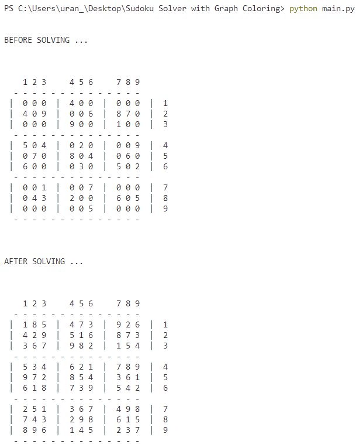

# Sudoku Solver with Graph Coloring

To execute the sudoku solver go to the main.py file and run it with this command: python main.py

A view of an example

To change the initial sudoku board go to the sudoku_board.py file and change the matrix contents of 
the function get_board.
